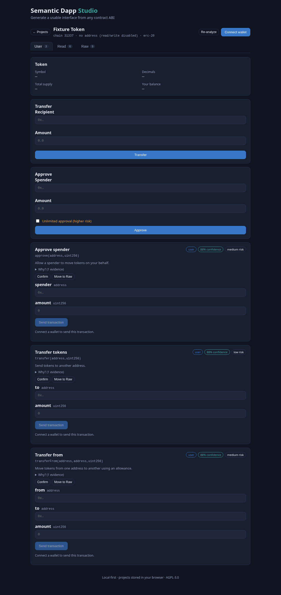

# Semantic Dapp

> Turn deployed smart contracts into usable applications.

Paste a contract address (or an ABI) and get a clear **user dApp**, an **admin console** and a **raw developer interface** — without hand-writing React forms, calldata encoding, role checks and transaction states.

- Import any EVM contract (by chain + address, or manual ABI / artifact)
- Detect standards, permissions and risks (deterministic-first)
- Generate user, admin and raw interfaces from a reviewed **semantic manifest**
- Connect a wallet and execute read/write calls (with simulation)
- Export a standalone, self-hostable open-source dApp

Quick start (target UX, WIP):

```bash
npx semantic-dapp import --chain 1 --address 0x...
```

## Status

`v0.1.0-beta` — public beta. The full pipeline works end to end: import by
address or ABI → standards/permission/risk analysis → reviewed semantic manifest
→ generated User/Admin/Raw UI → wallet execution → export a standalone dApp (or
build one headlessly with the `semantic-dapp` CLI). See the
[roadmap](docs/roadmap.md), the [changelog](CHANGELOG.md) and the current
[progress dashboard](PROGRESS.md).



- [`docs/demo.md`](docs/demo.md) — the ABI → generated app → transfer walkthrough.
- [`docs/demos.md`](docs/demos.md) — three ready-to-render demos (ERC-20, ERC-4626
  vault, role-gated RWA) built from the Foundry fixtures.
- [`docs/export.md`](docs/export.md) — export a bundle and host it, or use the CLI.

Beta means the surface is usable but still moving: while in `0.x`, minor versions
may include breaking changes.

## Design principles

- **Deterministic-first**: known standards and patterns are recognized by rules, not by a generative model.
- **AI-assisted, not AI-trusted**: AI may propose classifications but never signs transactions or hides uncertainty.
- **Safe fallback**: if meaning is not proven, a function lands in the Raw / Developer UI with an explicit warning.
- **Nothing is lost**: every ABI function stays reachable in the raw view.
- **Trusted components**: generated UI is built from verified components, not arbitrary generated React code.
- **Self-hostable by default**: run locally, export, and host without any Semantic Dapp cloud.
- **Open-source first**: spec, analyzer, renderer and CLI are public from the first release.

## Monorepo layout

```text
semantic-dapp/
├── apps/
│   └── studio/            # import, review, preview (Vite + React)
├── packages/
│   ├── spec/              # schema, types, validation (Zod + JSON Schema)
│   ├── resolver/          # address -> ABI/source (Sourcify, explorer, proxies)
│   ├── analyzer/          # standards detection (ERC-20, ...)
│   ├── classifier/        # operation type & audience routing
│   ├── components/        # trusted UI components
│   ├── renderer/          # manifest -> React sections
│   └── execution/         # viem/wagmi reads, simulation and writes
├── contracts/fixtures/    # Foundry test contracts (Counter, MockERC20)
└── docs/                  # roadmap, ADRs, progress
```

Packages `resolver`, `export`, `cli` and additional apps are planned for later phases (see the roadmap).

## Development

Requirements: Node `>=20`, pnpm `>=10`, and [Foundry](https://book.getfoundry.sh/) for contract fixtures.

```bash
pnpm install
pnpm build
pnpm test
pnpm --filter @semantic-dapp/studio dev
```

## Contributing

See [CONTRIBUTING.md](CONTRIBUTING.md) and [CODE_OF_CONDUCT.md](CODE_OF_CONDUCT.md).
Security issues: [SECURITY.md](SECURITY.md).

## License

[AGPL-3.0-only](LICENSE).
