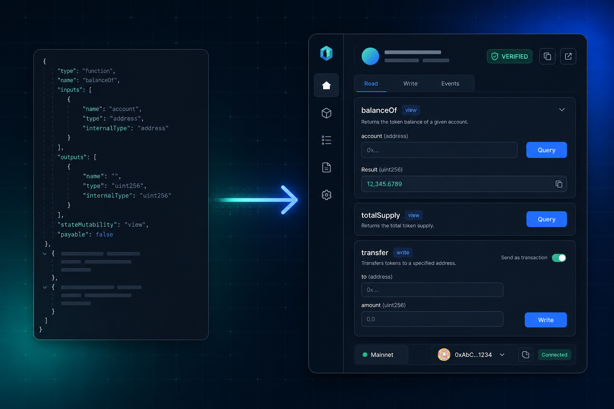
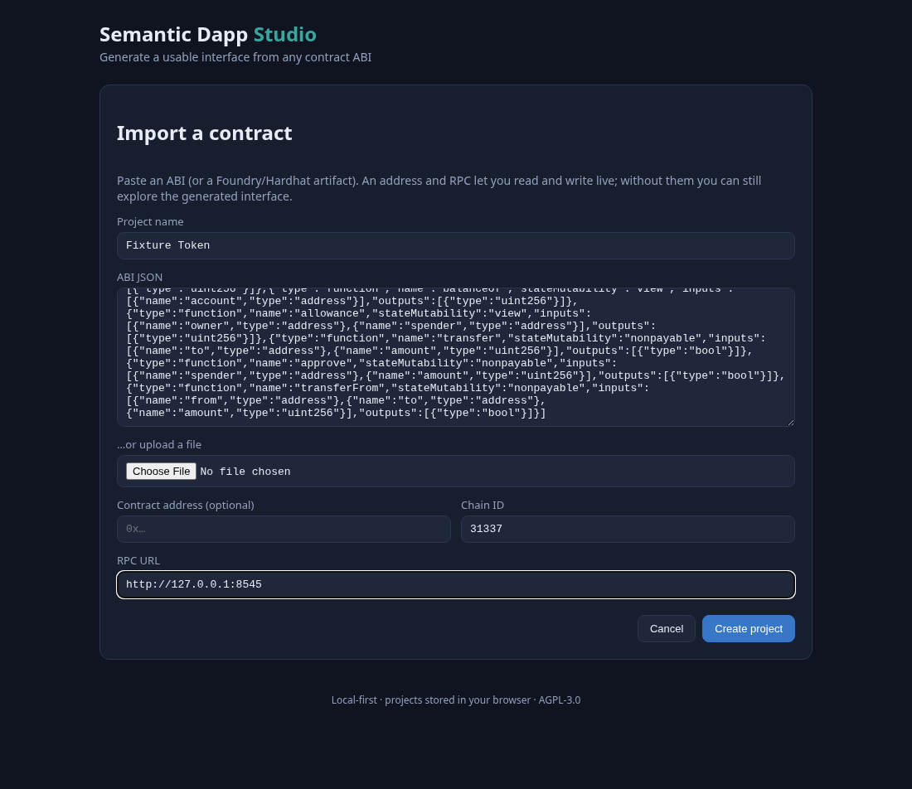
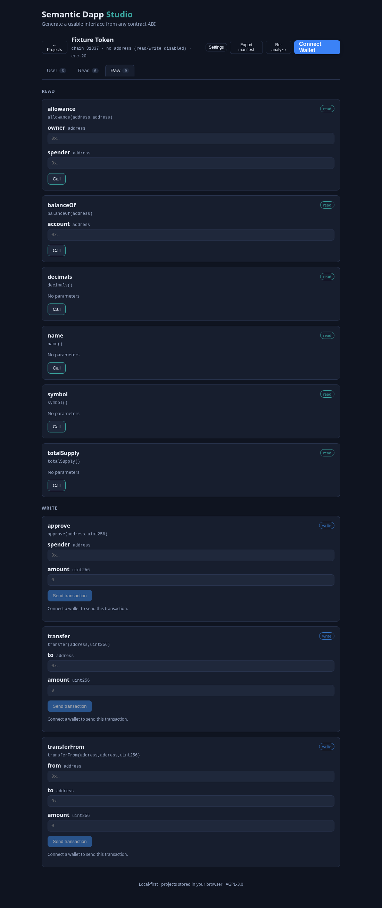
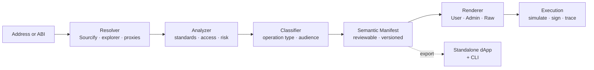

<div align="center">



<h1>Semantic Dapp</h1>

<b>Paste a contract address. Get a usable app.</b>

Semantic Dapp turns any deployed EVM contract into a clean **user dApp**, an **admin console**, and a **raw developer interface** — no hand-written React forms, calldata encoding, role checks, or transaction-state juggling.

<br/>

[](https://github.com/TacitvsXI/semantic-dapp/actions/workflows/ci.yml)
[](LICENSE)
[](CHANGELOG.md)
[](CONTRIBUTING.md)
[](https://www.typescriptlang.org/)
[](https://viem.sh/)

<sub>Deterministic-first · AI-assisted, never AI-trusted · Self-hostable · Open source</sub>

<br/>

⭐ **If this could save you from writing one more bespoke admin panel, star the repo — it genuinely helps.**

</div>

---

## The problem

Every team that ships a contract ends up rebuilding the same throwaway UI: a wallet button, a form per function, calldata encoding, `hasRole` checks, gas estimation, a spinner, an error decoder, and a "danger zone" for the scary admin methods. It's tedious, easy to get wrong, and it rots the moment the ABI changes.

Etherscan's _Write Contract_ tab gives you raw inputs with zero meaning. Bespoke frontends give you meaning but cost weeks. **Semantic Dapp gives you both** — a UI that understands the contract, generated from the ABI (and source/NatSpec when available), that you can review, trust, and self-host.

## What you get

<table>
<tr>
<td width="33%" valign="top">

**🧩 Import anything**

By chain + address (Sourcify / block explorer, proxy-aware) or by pasting an ABI / Foundry artifact.

</td>
<td width="33%" valign="top">

**🔎 Understand it**

Deterministic detection of standards, roles, permissions and risk — with a confidence score and evidence, not a black box.

</td>
<td width="33%" valign="top">

**🖥️ Use it**

Auto-generated **User**, **Admin** and **Raw** tabs. Connect a wallet, simulate, and execute reads/writes safely.

</td>
</tr>
</table>

<div align="center">



</div>

## Features

- 🧠 **Semantic manifest** — a reviewable, machine-readable understanding of the contract that sits between analysis and UI. Edit it, export it, version it.
- 🏷️ **Standards & access detection** — ERC-20 / 721 / 1155 / 4626, plus Ownable / AccessControl / Pausable / UUPS-upgradeable, via a member-based rule engine.
- 🛡️ **Safety first** — role-by-name pickers with live `hasRole` badges, "type CONFIRM" gates on critical actions, homoglyph/bidi text sanitization, staleness detection when a proxy is upgraded.
- ✍️ **Real execution** — viem + wagmi reads, `eth_call` **simulation before signing**, gas estimation, decoded revert reasons, and a local audit trail.
- 📦 **Export a standalone dApp** — package identity + ABI + reviewed manifest into a portable **bundle** and host it anywhere. No Semantic Dapp cloud, ever.
- 🧰 **CLI** — build, export, and serve apps headlessly (`semantic-dapp bundle | export | serve`).
- 🔌 **Wallet-fallback reads** — if a public RPC is missing or rate-limited, reads fall back to the connected wallet's provider.
- ♿ **Accessible & tested** — axe-core a11y gate, unit + e2e tests, and analyzer tests driven by real compiled Foundry ABIs.

## How it works



Everything upstream of the UI is **deterministic-first**: known patterns are recognized by rules with explicit evidence and confidence. AI may _propose_ a label, but it never signs a transaction and never hides uncertainty — anything unproven falls back to the Raw tab with a warning.

## Quick start

Requirements: Node `>=20`, pnpm `>=10`, and [Foundry](https://book.getfoundry.sh/) (only for the contract fixtures).

```bash
git clone https://github.com/TacitvsXI/semantic-dapp.git
cd semantic-dapp
pnpm install
pnpm build

# Launch the Studio (import → review → preview → export)
pnpm --filter @semantic-dapp/studio dev
```

Then open the Studio, paste a contract address (or an ABI), and preview the generated app. Prefer to see it instantly? Render one of the ready-made demos:

```bash
pnpm gen:demos                                  # build demo bundles from the fixtures
pnpm --filter @semantic-dapp/generated-app dev  # render a bundled dApp
```

## Try the demos

Three self-contained demos built from real compiled contracts:

| Demo      | Contract               | Shows off                                  |
| --------- | ---------------------- | ------------------------------------------ |
| **Token** | `MockERC20`            | balances, transfer, approve, mint          |
| **Vault** | `MockVault` (ERC-4626) | deposit / mint / withdraw / redeem         |
| **RWA**   | `MockRWA`              | AccessControl roles + Pausable + mint/burn |

See [`docs/demos.md`](docs/demos.md) for rendering them (optionally against a local Anvil chain), and [`docs/export.md`](docs/export.md) for exporting and hosting your own.

## What it understands today

| Category        | Supported                                                         |
| --------------- | ----------------------------------------------------------------- |
| Token standards | ERC-20, ERC-721, ERC-1155, ERC-4626                               |
| Access models   | Ownable, AccessControl (roles), Pausable, UUPS-upgradeable        |
| Proxies         | EIP-1967 detection → analyze the implementation                   |
| Sources         | Sourcify, block explorers (Etherscan v2 API), manual ABI/artifact |

Don't see your pattern? The Raw tab always exposes **every** ABI function, and the rule engine is designed to be extended — [contributions welcome](CONTRIBUTING.md).

## Why Semantic Dapp vs…

|                                 | Etherscan _Write_ | Bespoke frontend | **Semantic Dapp** |
| ------------------------------- | :---------------: | :--------------: | :---------------: |
| Time to a usable UI             |      instant      |      weeks       |    **minutes**    |
| Understands roles/standards     |        ❌         |   ✅ (by hand)   | **✅ automatic**  |
| Simulation before signing       |        ❌         |      maybe       |      **✅**       |
| Safe defaults for admin actions |        ❌         |      maybe       |      **✅**       |
| Self-host / export              |        ❌         |        ✅        |      **✅**       |
| Stays in sync with the ABI      |        n/a        |        ❌        |      **✅**       |

## Design principles

- **Deterministic-first** — known standards recognized by rules, not by a generative model.
- **AI-assisted, not AI-trusted** — AI may propose; it never signs or hides uncertainty.
- **Safe fallback** — unproven meaning lands in the Raw / Developer UI with a warning.
- **Nothing is lost** — every ABI function stays reachable.
- **Trusted components** — UI is built from verified components, not arbitrary generated React.
- **Self-hostable by default** — run locally, export, and host without any cloud.
- **Open-source first** — spec, analyzer, renderer and CLI are public from day one.

## Monorepo layout

```text
semantic-dapp/
├── apps/
│   ├── studio/            # import, review, preview, export (Vite + React)
│   └── generated-app/     # standalone template that renders a bundle
├── packages/
│   ├── spec/              # schema, types, validation (Zod + JSON Schema)
│   ├── resolver/          # address → ABI/source (Sourcify, explorer, proxies)
│   ├── analyzer/          # standards & capability detection
│   ├── classifier/        # operation type & audience routing
│   ├── components/        # trusted UI components
│   ├── renderer/          # manifest → React sections
│   ├── execution/         # viem/wagmi reads, simulation, writes
│   ├── export/            # portable SemanticBundle artifact
│   └── cli/               # semantic-dapp bundle | export | serve
├── contracts/fixtures/    # Foundry contracts (MockERC20, MockVault, MockRWA)
└── docs/                  # roadmap, ADRs, progress, demos
```

## Status & roadmap

`v0.1.0-beta` — the full pipeline works end to end. Beta means the surface is usable but still moving: while in `0.x`, minor versions may include breaking changes.

- 🗺️ [Roadmap](docs/roadmap.md) · 📓 [Changelog](CHANGELOG.md) · 📊 [Progress dashboard](PROGRESS.md)
- 🎨 [UX roadmap](docs/ux-improvements.md) · 🧱 [Architecture decisions (ADRs)](docs/adr)

## Contributing

Issues, ideas, and PRs are all welcome — especially new standard/pattern detectors and UX polish. Start with [CONTRIBUTING.md](CONTRIBUTING.md) and [CODE_OF_CONDUCT.md](CODE_OF_CONDUCT.md). Found a security issue? See [SECURITY.md](SECURITY.md).

<div align="center">

### ⭐ Star it, watch it, break it, tell us what's missing.

If Semantic Dapp is useful to you, a star is the single best way to help others find it.

</div>

## License

[AGPL-3.0-only](LICENSE) — free to use, modify, and self-host; network-served modifications must share source.
